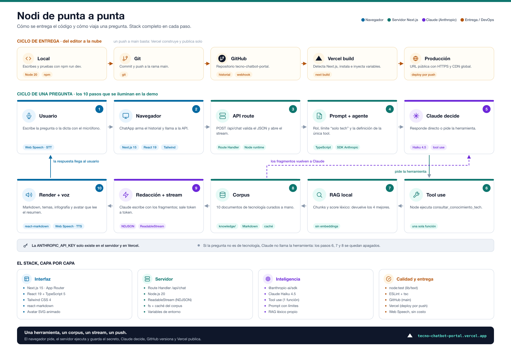

# Tech Mentor (Nodi)

Mini-agente educativo de **tecnología** para un curso de entrenamiento. Cumple el lab de **una sola tool**: Claude decide cuándo llamar `consultar_conocimiento_tech`; Node la ejecuta sobre un corpus Markdown local (RAG). El chat es por texto o voz, un avatar lee un resumen corto, y un panel muestra **cómo responde** cada petición.

Solo cubre temas de tecnología. El resto se rechaza y se redirige al tema.

Demo en línea: [https://tecno-chatbot-portal.vercel.app](https://tecno-chatbot-portal.vercel.app)  
En local: `npm run dev` → [http://localhost:3000](http://localhost:3000)

## Arquitectura

No hay MCP ni un backend aparte. El lab pedía **una** función; el corpus vive en `knowledge/`.

Infografías para clase (también en [docs/](docs/)):

| Pieza | Para qué | Archivo |
|-------|----------|---------|
| Flujo de punta a punta | Presentar: nodos, stack y GitHub → Vercel | [flujo-nodi.png](docs/flujo-nodi.png) |
| Arquitectura detallada | Explicar cada paso, eventos NDJSON y RAG | [arquitectura-nodi.png](docs/arquitectura-nodi.png) |



```
Navegador (Next.js)
  │  texto o Web Speech (STT, Chrome)
  │  POST /api/chat  { messages }  →  stream NDJSON
  ▼
API route (servidor, Node)
  │  ANTHROPIC_API_KEY (nunca llega al cliente)
  │  Claude Haiku: system prompt + tools
  │  loop de tool_use
  ▼
consultar_conocimiento_tech  (única tool)
  │  búsqueda léxica en knowledge/*.md
  ▼
stream de la respuesta  →  Markdown + infografía + temas
  │
  ▼
Web Speech TTS  →  avatar lee el resumen
```

## Qué demuestra el curso

| Tema | Cómo se ve en el proyecto |
|------|---------------------------|
| API key | Variable de entorno en el servidor (`.env.local` / Vercel). Nunca en el navegador. |
| Prompt engineering | Rol, límites (solo tech), formato de resumen, temas e infografía. |
| Tool use | Una tool. Claude propone; Node ejecuta. |
| RAG | Retrieval sobre Markdown curado, no un dump enorme. |
| Streaming | La respuesta aparece token a token (NDJSON). |
| DevOps | GitHub Actions (test, lint, build) + Vercel: cada push a `main` verifica y despliega. |

## Interfaz

- Avatar femenino ilustrado (fijo arriba): parpadea, gesticula y mueve la boca al hablar.
- **Cómo responde Nodi**: 10 nodos que se iluminan (entrada, API route, prompt, modelo, tool, RAG, redacción, streaming, render, voz). En móvil el panel se colapsa.
- Respuestas en Markdown (listas, código, negritas).
- Infografías de pasos, comparación o conceptos cuando el tema lo amerita.
- 3–5 **temas relacionados** clicables al final de cada respuesta.
- Micrófono (Chrome) y TTS del sistema, sin costo extra.

## Requisitos

- Node.js 20+
- Clave de [Anthropic / Claude](https://console.anthropic.com/settings/keys)

## Cómo correrlo

```bash
npm install
cp .env.example .env.local
# Edita .env.local y pega ANTHROPIC_API_KEY
npm run dev
```

Abre [http://localhost:3000](http://localhost:3000).

```bash
npm test
npm run test:e2e
npm run build
```

- `npm test` — unitarias e integración (RAG, parseo, validación de `/api/chat`).
- `npm run test:e2e` — Playwright: recorrido de visitante + pregunta + chip (sin simular voz). Ver [adaptación de los labs](docs/proyecto-final/adaptacion-labs-testing.md).

## Pruebas sugeridas

1. «¿Qué es RAG?» → usa la tool y cita el corpus.
2. «Tengo 15 minutos, ¿qué practico de Git?» → ejercicio del material.
3. «¿Qué es ITIL?» → llama la tool; RAG puede marcar *sin resultados* y Claude responde igual (sin fingir internet).
4. «Dame una receta de lasaña» → rechazo, sin tool.
5. Chip de temas relacionados → se envía como pregunta tuya.
6. Micrófono en **Chrome** → transcribe y envía.
7. El avatar habla el resumen (a veces el navegador pide un clic previo).

## Límites (a propósito)

- Corpus pequeño y curado.
- **Dictado en Chrome.** Edge, Brave, Firefox y Arc suelen fallar (`network`) porque el reconocimiento es un servicio del fabricante, no de esta app. El texto siempre funciona.
- Sin búsqueda web. El nodo de internet se eliminó para no simular una fuente que no existe.
- Infografías dibujadas con datos estructurados del modelo, no imágenes de un servicio de pago.
- Avatar ilustrado, no lip-sync fotoreal.
- Sin login ni historial en servidor.

## Publicar en Vercel (opcional)

[Vercel](https://vercel.com) es el hosting de quien hace Next.js. Subes el repo, ellos **construyen** la app y te dan una URL `https://….vercel.app` que cualquiera puede abrir. Es el mismo código; no hace falta que tu laptop esté encendida.

Pasos (ya hecho en este repo): el proyecto está en Vercel con `ANTHROPIC_API_KEY`. URL: [https://tecno-chatbot-portal.vercel.app](https://tecno-chatbot-portal.vercel.app).

GitHub ([cristianvirtus/tecno-chatbot-portal](https://github.com/cristianvirtus/tecno-chatbot-portal)) está conectado a Vercel: un `git push` a `main` dispara el build y publica. El mismo push corre [GitHub Actions](https://github.com/cristianvirtus/tecno-chatbot-portal/actions): tests, `tsc`, lint y `next build`.

Guion del showcase: [docs/proyecto-final/guion-showcase.md](docs/proyecto-final/guion-showcase.md).

Para volver a publicar a mano: `npx vercel --prod`.

## Qué es gratis y qué no

| Pieza | Costo |
|-------|--------|
| Chat, avatar, infografías, flujo didáctico | Gratis (código) |
| Voz entrada/salida | Gratis (Web Speech del navegador) |
| Hosting en Vercel (hobby) | Gratis para una demo |
| Claude (Haiku) | De pago por uso (centavos en una demostración) |
